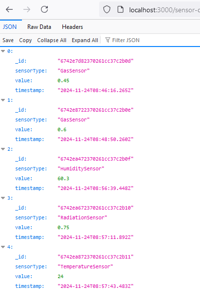
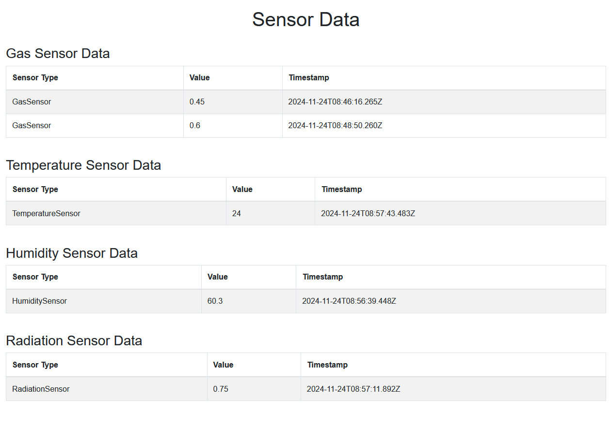

# Sensor System Simulation

This project simulates sensor data collection, storage, and retrieval via a REST API. The backend uses **Node.js**, **MongoDB**, and **Express**, while the frontend is built with **HTML**, **JavaScript**, and **Bootstrap** for a modern and responsive UI.

## Features

- **Backend API**: 
  - RESTful endpoints to post and retrieve sensor data.
  - Data is stored in a MongoDB database.
- **Frontend**:
  - Dynamic tables to display sensor data (Gas, Temperature, Humidity, and Radiation sensors).
  - Bootstrap-styled interface for a modern look.
- **Simulation of Multiple Sensor Types**: 
  - GasSensor
  - TemperatureSensor
  - HumiditySensor
  - RadiationSensor

## Requirements

### Server

- **Node.js** (v14.x or higher)
- **MongoDB** (locally or remotely hosted)
- **npm** (Node package manager)

### C++ Part

- **C++** (v20)
- **CMake** (build system)
- **Visual Studio Community Edition** (v2022)

## Installation and Setup

Follow these steps to set up the project on your local machine.

### 1. Clone the repository

```bash
git clone https://github.com/your-username/sensor-system-simulation.git
cd sensor-system-simulation
```

### 2. Install dependencies

From the project root directory, install the required dependencies for the backend:

```bash
cd server
npm install
```

This will install all the necessary Node.js packages, including **express**, **mongodb**, and **body-parser**.

### 3. Set up MongoDB

Ensure that MongoDB is installed and running locally or that you have access to a remote MongoDB database. If you're using a local MongoDB setup, the server will connect to `mongodb://localhost:27017/sensor_data`.

### 4. Run the Backend Server

In the `server` directory, run the backend server using the following command:

```bash
node server.js
```

You should see the following output indicating the server is running and connected to MongoDB:

```bash
Server running at http://localhost:3000
Connected to MongoDB.
```

The server will expose a REST API at `http://localhost:3000` that you can use to interact with the sensor data.

### 5. Run the Frontend Server

To serve the `index.html` file with the simulated sensor data table, you'll need to run a local HTTP server. You can use **http-server**, which can be installed globally with `npm`:

```bash
npm install -g http-server
```

Once installed, navigate to the `server/public` directory and run:

```bash
http-server -p 8090
```

You should see output like this:

```bash
Starting up http-server, serving ./
http-server version: 14.1.1
Available on:
  http://192.168.56.1:8090
  http://127.0.0.1:8090
```

Access the frontend by opening `http://localhost:8090` in your web browser. The page will display the sensor data fetched from the backend API.

---

## API Endpoints

### 1. POST `/sensor-data`

To add sensor data, make a POST request with the sensor type and value in JSON format. The endpoint will return a success message with the ID of the inserted data.

**Request Example (using `curl`):**

```bash
curl -X POST http://localhost:3000/sensor-data -H "Content-Type: application/json" -d "{\"sensorType\": \"GasSensor\", \"value\": 0.45}"
```

**Response Example:**

```json
{
  "message": "Sensor data added with ID: 6742e7d82370261cc37c2b0d"
}
```

### 2. GET `/sensor-data`

To retrieve all sensor data, make a GET request to the `/sensor-data` endpoint. The data will be returned in JSON format.

**Request Example (using a browser or `curl`):**

```bash
curl -X GET http://localhost:3000/sensor-data
```

**JSON Response Example:**



**HTML Example**



---

## Troubleshooting

If you encounter issues with the server, here are some common errors and solutions:

### 1. Server not starting

**Error Message:**

```
Failed to connect to localhost port 3000.
```

**Solution:** Ensure MongoDB is running locally or that you've set up the correct MongoDB URI in the server. Check if the database connection is configured properly.

---

### 2. Invalid JSON format errors when sending POST requests

**Error Message:**

```
{"error":"Invalid JSON format."}
```

**Solution:** Ensure that your JSON payload is correctly formatted. Use double quotes for both keys and string values in JSON:

```bash
curl -X POST http://localhost:3000/sensor-data -H "Content-Type: application/json" -d "{\"sensorType\": \"GasSensor\", \"value\": 0.45}"
```

Note: Incorrect syntax, such as missing or mismatched quotes, will lead to this error.

---

## Running Tests

To run tests on your API endpoints, you can use tools such as **Postman** or **cURL** to simulate POST and GET requests. Alternatively, you can integrate testing libraries like **Mocha** and **Chai** for automated testing in the `server` directory.

---

## Future Enhancements

- **User Authentication**: Secure access to the sensor data via user authentication (JWT, OAuth).
- **Data Visualization**: Integrate a charting library (e.g., Chart.js) to display sensor data over time visually.
- **Data Filtering and Sorting**: Implement options to filter and sort the sensor data based on date, type, and value.

---

## License

This project is licensed under the MIT License - see the [LICENSE](LICENSE) file for details.
